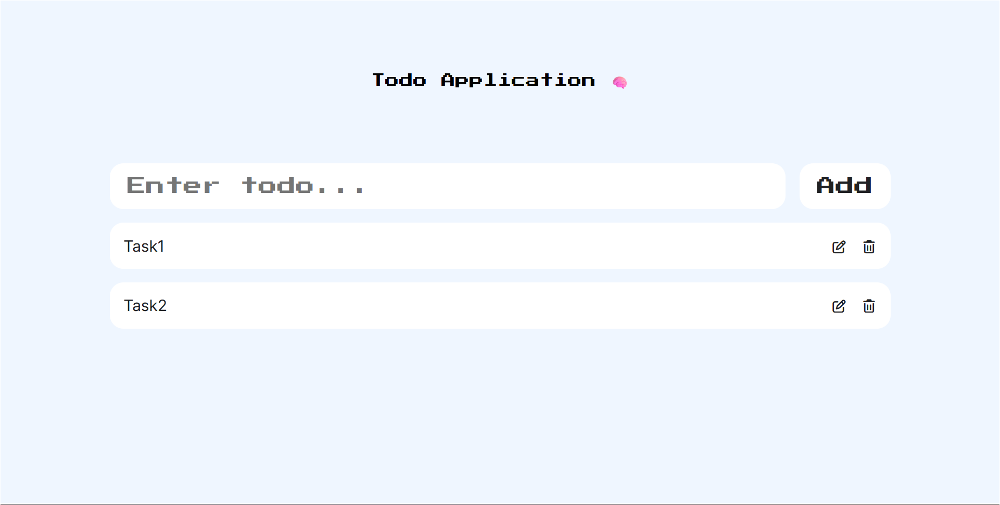

# 📝 MERN Todo App

A simple yet complete **MERN Stack Todo Application** I built while learning full-stack development.  
It includes all CRUD operations (Create, Read, Update, Delete) — with a clean UI and solid backend integration.

---

## 🚀 Tech Stack
**Frontend:** React + Vite + Axios + FontAwesome  
**Backend:** Node.js + Express.js + MongoDB + Mongoose  
**Styling:** CSS + FontAwesome icons  

---

## ⚙️ Features
- Add new todos 🆕  
- Edit existing todos ✏️  
- Delete todos 🗑️  
- Fetch todos from MongoDB in real time  
- Fully connected REST API (Express + Mongoose)  
- Clean and responsive UI  

---

## 🧠 What I Learnt
- Complete **CRUD** flow in MERN stack  
- Working with **Axios** for frontend-backend communication  
- Using **MongoDB + Mongoose** for schema design  
- Building modular APIs with **Express.js**  
- Managing state and props in **React**  
- Integrating **FontAwesome** icons  
- Writing clean, reusable component structures  

---

## ⚡️ How to Run Locally

### 🔹 Backend
```bash
cd Backend
npm install
npm run dev
Runs on → http://localhost:5000

### 🔹 Frontend

cd Frontend
npm install
npm run dev
Runs on → http://localhost:5173


## Folder Structures - 
Backend/
├── models/
│   └── schema.js           # Mongoose schema definition
│
├── src/
│   └── app.js              # All Express APIs
│
├── utils/
│   └── database.js         # Database connection logic
│
└── package.json

Frontend/
├── src/
│   ├── components/
│   │   ├── TodoCard.jsx
│   │   ├── Todolist.jsx
│   │   └── TodoInput.jsx
│   └── App.jsx
│
└── package.json

## 📸 Preview



💪 Author

JayaVardhan Tummala
Just another dev grinding his way up the MERN stack 🧠⚡
“Code. Break. Fix. Repeat.”